# Rajah 3.1: Proses Kajian

Rajah berikut menggambarkan keseluruhan aliran proses kajian yang dilaksanakan dalam penyelidikan ini, bermula daripada pemahaman konteks kajian sehinggalah kepada rumusan dan dokumentasi dapatan.

```mermaid
flowchart TD
    A["**Pemahaman Konteks Kajian**\nMengesahkan keperluan penyelidikan"]
    B["**Mendefinisikan Masalah Kajian**\nBerdasarkan landskap pendidikan luar bandar di Sabah"]
    C["**Penelitian Literatur dan Teori**\nMengenal pasti jurang dalam pengetahuan sedia ada"]
    D["**Pembangunan Model Kajian**\nBerdasarkan teori asas yang dikenal pasti"]
    E["**Persoalan dan Objektif Kajian**\nPembangunan hipotesis"]
    F["**Reka Bentuk Kajian Kuantitatif**\nPendekatan Tinjauan"]
    G["**Reka Bentuk Kajian**\n• Operasionalisasi konstruk utama & pengukuran\n• Pembangunan soal selidik\n• Penentuan unit analisis\n• Reka bentuk persampelan\n• Pra-ujian"]
    H["**Pengumpulan Data**"]
    I["**Penyaringan Data**\nSPSS Versi 29"]
    J["**Analisis PLS-SEM**\nSmartPLS — Pengujian Hipotesis"]
    K["**Tafsiran & Perbincangan Dapatan**\nRumusan dan Dokumentasi"]

    A --> B
    B --> C
    C --> D
    D --> E
    E --> F
    F --> G
    G --> H
    H --> I
    I --> J
    J --> K

    style A fill:#1E3A5F,color:#FFFFFF,stroke:#1E3A5F
    style B fill:#1E3A5F,color:#FFFFFF,stroke:#1E3A5F
    style C fill:#1E3A5F,color:#FFFFFF,stroke:#1E3A5F
    style D fill:#1E3A5F,color:#FFFFFF,stroke:#1E3A5F
    style E fill:#1E3A5F,color:#FFFFFF,stroke:#1E3A5F
    style F fill:#1E3A5F,color:#FFFFFF,stroke:#1E3A5F
    style G fill:#2E6DA4,color:#FFFFFF,stroke:#2E6DA4
    style H fill:#1E3A5F,color:#FFFFFF,stroke:#1E3A5F
    style I fill:#1E3A5F,color:#FFFFFF,stroke:#1E3A5F
    style J fill:#1E3A5F,color:#FFFFFF,stroke:#1E3A5F
    style K fill:#1E3A5F,color:#FFFFFF,stroke:#1E3A5F
```

**Sumber:** Adaptasi daripada Seksyen 3.5 Proses Kajian
