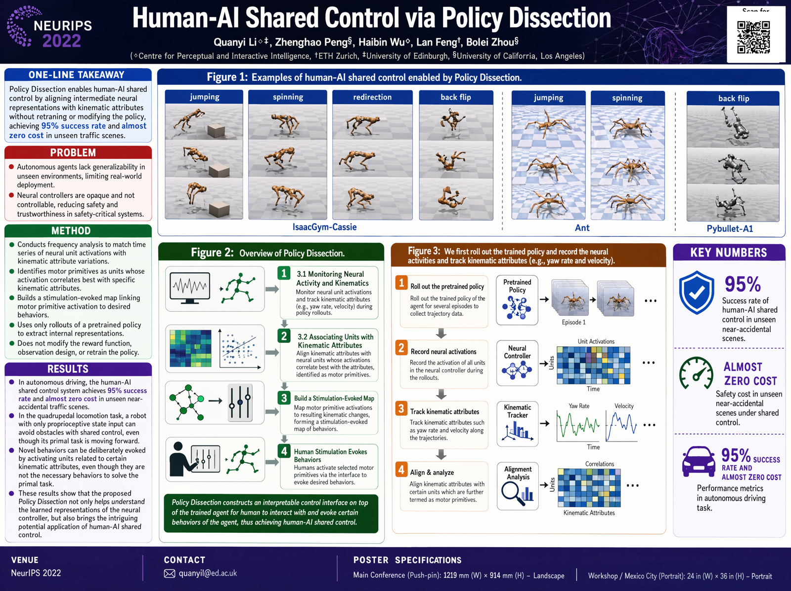
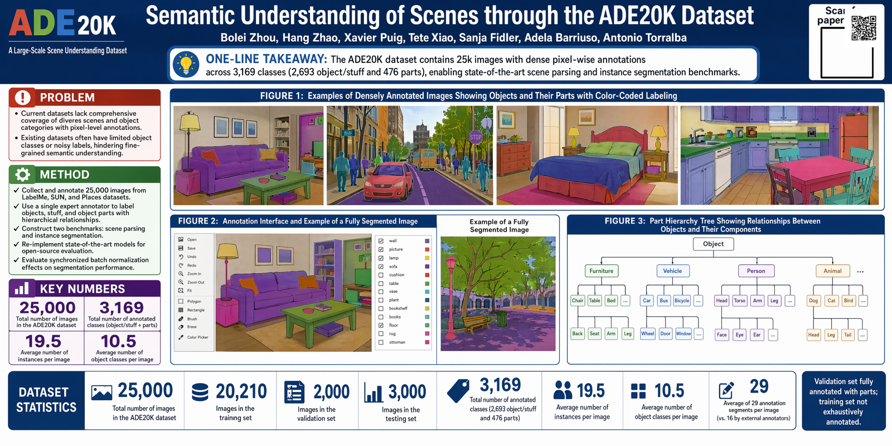

# Example posters

Conference posters generated by `paperbanana poster` from the papers'
PDFs — each designed by an image model at full power, then grounded and
faithfulness-audited against the source paper, and rendered at the
venue's exact physical size. Previews below are downscaled; the command
produces a high-resolution PNG and a print-ready PDF.

| Example | Paper | Venue (size) | Reference |
|---|---|---|---|
| `policy_dissection/` | Human-AI Shared Control via Policy Dissection ([2206.00152](https://arxiv.org/abs/2206.00152)) | NeurIPS (1219×914 mm, landscape) | author poster: [bolei_awesome_posters](https://github.com/zhoubolei/bolei_awesome_posters) |
| `ade20k/` | Semantic Understanding of Scenes through ADE20K ([1608.05442](https://arxiv.org/abs/1608.05442)) | CVPR (2134×1067 mm, landscape) | author poster: bolei_awesome_posters |




## How they were made

```bash
paperbanana poster --paper 2206.00152.pdf --venue neurips \
  --qr-url https://arxiv.org/abs/2206.00152
```

Each folder holds `preview.png` (committed), `grounding.txt` (the verified
paper facts the design was built from), and `audit.json` (the faithfulness
findings). The full-resolution PNG and the print-ready PDF are produced by
the command but kept out of the repo for size.

## Honest notes

- **Faithfulness audit.** A VLM re-reads the rendered poster against the
  paper and flags contradictions; `audit.json` records what it found. It
  surfaces *candidate* discrepancies and over-reports on dense papers —
  per-finding verification is a planned precision upgrade. Real catches on
  these examples include an image-model email typo and an approximated
  dataset count.
- **Small text.** Current image generation occasionally garbles small text
  (a mistyped email, a rounded number). Embedding the paper's *real*
  figures/text (`--figures real`, the next milestone) removes this for the
  load-bearing content.
- **Print resolution.** A single ~4K image on a large board is ~70–80 DPI
  (a compliance *warning*, not a failure — venues regulate physical size,
  not your file's DPI). Tiling/upscaling for higher print DPI is on the
  roadmap.
